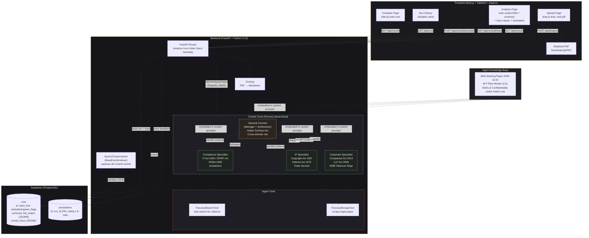
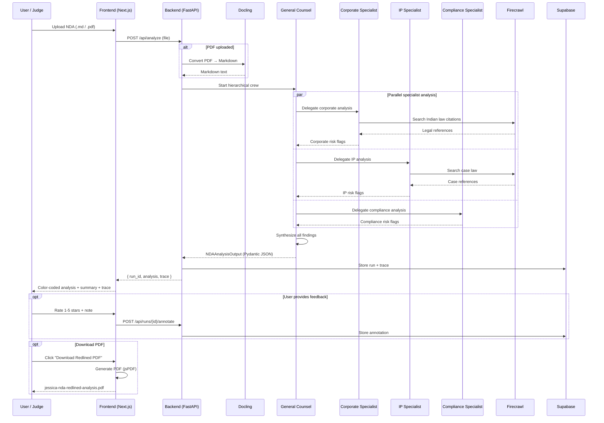

# Jessica — AI Legal Team

Multi-agent NDA risk analyzer grounded in Indian law. Four specialized AI agents (General Counsel, Corporate, IP, Compliance) review non-disclosure agreements clause-by-clause, flag risks with color-coded severity, and cite Indian statutes and case law for every finding.

Built for the OpenCode Buildathon (MaaS track).

---

## Architecture (Mermaid)





## Architecture (ASCII)

```
                                 Jessica — System Architecture
                                 =============================

    ┌─────────────────────────────────────────────────────────────────────┐
    │                        FRONTEND (Next.js)                          │
    │                                                                     │
    │   ┌──────────┐  ┌───────────────┐  ┌─────────┐  ┌───────────┐     │
    │   │  Upload   │  │   Analysis    │  │ History │  │  Compare  │     │
    │   │  Page     │  │   Page        │  │  Page   │  │   Page    │     │
    │   └────┬─────┘  └───────┬───────┘  └────┬────┘  └─────┬─────┘     │
    │        │                │               │              │           │
    │        └────────────────┴───────────────┴──────────────┘           │
    │                         │                                          │
    │              ┌──────────┴──────────┐                               │
    │              │   API Client        │                               │
    │              │   (src/lib/api.ts)  │                               │
    │              └──────────┬──────────┘                               │
    └─────────────────────────┼───────────────────────────────────────────┘
                              │ HTTP (REST)
                              ▼
    ┌─────────────────────────────────────────────────────────────────────┐
    │                     BACKEND (FastAPI)                               │
    │                                                                     │
    │   Endpoints:                                                        │
    │   POST /api/analyze          Upload NDA → run crew → return JSON   │
    │   GET  /api/runs             List all past runs                    │
    │   GET  /api/runs/{id}        Full run details                      │
    │   GET  /api/runs/{id}/trace  CrewAI execution trace                │
    │   POST /api/runs/{id}/annotate   Human rating + note               │
    │   GET  /api/runs/{id}/annotations                                  │
    │                                                                     │
    │   ┌─────────────────────────────────────────────────────────┐      │
    │   │                   CrewAI Crew                            │      │
    │   │              (Process.hierarchical)                      │      │
    │   │                                                         │      │
    │   │   ┌─────────────────────────────────────────────┐       │      │
    │   │   │         General Counsel (Manager)            │       │      │
    │   │   │                                             │       │      │
    │   │   │   Synthesizes all specialist findings into   │       │      │
    │   │   │   final NDAAnalysisOutput (Pydantic JSON)    │       │      │
    │   │   └──────────────────┬──────────────────────────┘       │      │
    │   │                      │ delegates + synthesizes           │      │
    │   │          ┌───────────┼───────────┐                      │      │
    │   │          ▼           ▼           ▼                      │      │
    │   │   ┌───────────┐ ┌─────────┐ ┌────────────┐            │      │
    │   │   │ Corporate │ │   IP    │ │ Compliance │            │      │
    │   │   │Specialist │ │Specialist│ │ Specialist │            │      │
    │   │   │           │ │         │ │            │            │      │
    │   │   │ Companies │ │Copyright│ │ IT Act     │            │      │
    │   │   │ Act 2013  │ │Act 1957 │ │ DPDP Act  │            │      │
    │   │   │ LLP Act   │ │Patents  │ │ SEBI Regs │            │      │
    │   │   │ 2008      │ │Act 1970 │ │ FEMA 1999 │            │      │
    │   │   └─────┬─────┘ └────┬────┘ └─────┬──────┘            │      │
    │   │         │            │             │                    │      │
    │   │         └────────────┴─────────────┘                    │      │
    │   │                      │                                  │      │
    │   │              ┌───────┴────────┐                         │      │
    │   │              │  Firecrawl     │                         │      │
    │   │              │  Search Tool   │                         │      │
    │   │              │  + Scrape Tool │                         │      │
    │   │              └───────┬────────┘                         │      │
    │   │                      │ web search for legal refs        │      │
    │   │                      ▼                                  │      │
    │   │              ┌───────────────┐                          │      │
    │   │              │   Internet    │                          │      │
    │   │              │  (case law,   │                          │      │
    │   │              │   statutes)   │                          │      │
    │   │              └───────────────┘                          │      │
    │   └─────────────────────────────────────────────────────────┘      │
    │                                                                     │
    │   ┌──────────────────────┐    ┌─────────────────────────┐          │
    │   │  Trace Listener      │    │  Docling (PDF → MD)     │          │
    │   │  (BaseEventListener) │    │  (server-side convert)  │          │
    │   │  Captures all agent  │    │                         │          │
    │   │  execution events    │    │  Runs before agents     │          │
    │   └──────────┬───────────┘    └─────────────────────────┘          │
    │              │                                                      │
    └──────────────┼──────────────────────────────────────────────────────┘
                   │ stores runs + traces + annotations
                   ▼
    ┌─────────────────────────────────────────────────────────────────────┐
    │                        SUPABASE                                     │
    │                                                                     │
    │   ┌────────────────────────────┐  ┌──────────────────────────┐     │
    │   │        runs                │  │     annotations          │     │
    │   │                            │  │                          │     │
    │   │  id            UUID PK     │  │  id          UUID PK     │     │
    │   │  created_at    TIMESTAMPTZ │  │  run_id      UUID FK     │     │
    │   │  input_text    TEXT        │  │  rating      INT (1-5)   │     │
    │   │  red_flags     INT         │  │  note        TEXT        │     │
    │   │  yellow_flags  INT         │  │  created_at  TIMESTAMPTZ │     │
    │   │  green_flags   INT         │  └──────────────────────────┘     │
    │   │  summary       TEXT        │                                    │
    │   │  full_output   JSONB       │                                    │
    │   │  crewai_trace  JSONB       │                                    │
    │   └────────────────────────────┘                                    │
    └─────────────────────────────────────────────────────────────────────┘
```

## Data Flow

```
1. Judge uploads NDA (.md file)
           │
           ▼
2. FastAPI receives file
           │
           ▼
3. CrewAI Crew kicks off (hierarchical process)
           │
           ├──► Corporate Specialist ──► analyzes entity/signatory/governance clauses
           ├──► IP Specialist ──────────► analyzes confidentiality/IP/trade secret clauses
           └──► Compliance Specialist ──► analyzes jurisdiction/data privacy/regulatory clauses
                     │
                     │ (agents use Firecrawl to search web for citations when needed)
                     │
                     ▼
4. General Counsel synthesizes all findings
           │
           ▼
5. Structured output (Pydantic JSON):
   ┌────────────────────────────────────────────┐
   │  NDAAnalysisOutput                         │
   │  ├── clauses: [FlaggedClause, ...]         │
   │  │   ├── original_text                     │
   │  │   ├── risk_level (red|yellow|green)     │
   │  │   ├── clause_type                       │
   │  │   ├── explanation                       │
   │  │   ├── citation (Indian law)             │
   │  │   └── reference_section                 │
   │  ├── summary (GC's synthesis)              │
   │  ├── red_flags (count)                     │
   │  ├── yellow_flags (count)                  │
   │  └── green_flags (count)                   │
   └────────────────────────────────────────────┘
           │
           ▼
6. Stored in Supabase (run + trace)
           │
           ▼
7. Frontend renders:
   • Color-coded annotated NDA (inline red/yellow/green highlights)
   • Summary panel with flag count badges
   • Agent reasoning trace (expandable timeline)
   • Annotation form (1-5 stars + note)
```

## Tech Stack

| Layer | Technology |
|---|---|
| Frontend | Next.js 15, TypeScript, Tailwind CSS, shadcn/ui, Motion |
| Backend | Python 3.12, FastAPI, CrewAI |
| LLM | OpenAI GPT-5.4 Mini |
| Web Search | Firecrawl (search + scrape) |
| PDF Parsing | Docling (server-side) |
| Database | Supabase (PostgreSQL) |
| Observability | CrewAI BaseEventListener → Supabase → Frontend |

## Agent Knowledge Base

Each agent's system prompt is grounded in the **IIMA Working Paper No. 2025-12-01** (M P Ram Mohan et al.) — a practice note on NDAs and confidentiality clauses under Indian law.

| Agent | Domain Knowledge |
|---|---|
| General Counsel | Indian Contract Act 1872 (Sections 10, 23, 27, 73-74), remedies (injunctions, Anton Piller orders), M&A/SEBI context, cross-domain risk synthesis |
| Corporate Specialist | Companies Act 2013 (Sections 179, 46, 180), LLP Act 2008, signatory authority, permitted disclosures, return/destruction clauses, M&A/SEBI Takeover compliance |
| IP Specialist | Copyright Act 1957, Patents Act 1970, Trade Marks Act 1999, IT Act s.72A, common law duty of fidelity (Talbot v General Television), trade secret perpetuity, Anton Piller orders |
| Compliance Specialist | IT Act 2000 s.43A, SPDI Rules 2011, DPDP Act 2023, FEMA 1999, SEBI Insider Trading Regs, whistleblowing/public interest carve-outs, export controls |

## Guardrails

- **Citation anchoring:** Every risk flag must cite Indian law (statute, section, or case law). No citation = "Unable to assess."
- **Confidence threshold:** Low-confidence assessments return "Insufficient information" instead of guessing.
- **Flag count verification:** Backend recomputes red/yellow/green counts from the actual clause list — does not trust LLM arithmetic.

## Quick Start

```bash
# 1. Backend
cd backend
python3.12 -m venv .venv
source .venv/bin/activate
pip install -r requirements.txt
cp .env.example .env   # fill in your keys
uvicorn app.main:app --port 8000

# 2. Frontend
cd frontend
npm install
cp .env.local.example .env.local
npm run dev

# 3. Open http://localhost:3000
```

### Environment Variables

**Backend (`.env`):**
```
OPENAI_API_KEY=sk-...
SUPABASE_URL=https://xxx.supabase.co
SUPABASE_KEY=eyJ...
FIRECRAWL_API_KEY=fc-...
```

**Frontend (`.env.local`):**
```
NEXT_PUBLIC_API_URL=http://localhost:8000
```

### Supabase Setup

Run this SQL in your Supabase SQL Editor:

```sql
CREATE TABLE IF NOT EXISTS runs (
    id UUID PRIMARY KEY DEFAULT gen_random_uuid(),
    created_at TIMESTAMPTZ DEFAULT now(),
    input_text TEXT NOT NULL,
    red_flags INTEGER NOT NULL DEFAULT 0,
    yellow_flags INTEGER NOT NULL DEFAULT 0,
    green_flags INTEGER NOT NULL DEFAULT 0,
    summary TEXT NOT NULL DEFAULT '',
    full_output JSONB NOT NULL DEFAULT '{}',
    crewai_trace JSONB DEFAULT NULL
);

CREATE TABLE IF NOT EXISTS annotations (
    id UUID PRIMARY KEY DEFAULT gen_random_uuid(),
    run_id UUID NOT NULL REFERENCES runs(id) ON DELETE CASCADE,
    rating INTEGER NOT NULL CHECK (rating >= 1 AND rating <= 5),
    note TEXT,
    created_at TIMESTAMPTZ DEFAULT now()
);

ALTER TABLE runs ENABLE ROW LEVEL SECURITY;
ALTER TABLE annotations ENABLE ROW LEVEL SECURITY;

CREATE POLICY "service_role_all_runs" ON runs
    FOR ALL USING (auth.role() = 'service_role')
    WITH CHECK (auth.role() = 'service_role');

CREATE POLICY "service_role_all_annotations" ON annotations
    FOR ALL USING (auth.role() = 'service_role')
    WITH CHECK (auth.role() = 'service_role');
```

## Tests

```bash
cd backend
source .venv/bin/activate
pytest tests/ -v   # 40 tests
```

## Project Structure

```
jessica/
├── backend/
│   ├── app/
│   │   ├── agents/
│   │   │   ├── crew.py              # 4-agent hierarchical crew
│   │   │   ├── general_counsel.py   # GC agent + IIMA knowledge
│   │   │   ├── specialists.py       # Corporate, IP, Compliance agents
│   │   │   └── trace_listener.py    # BaseEventListener for observability
│   │   ├── routers/
│   │   │   ├── analysis.py          # /analyze, /runs, /annotate endpoints
│   │   │   └── traces.py            # /trace endpoint
│   │   ├── tools/
│   │   │   └── firecrawl_tools.py   # FirecrawlSearchTool, FirecrawlScrapeTool
│   │   ├── config.py                # Env var loading
│   │   ├── database.py              # Supabase client
│   │   ├── main.py                  # FastAPI app
│   │   └── models.py                # Pydantic models
│   ├── tests/                       # 40 unit tests
│   ├── migrations/                  # Supabase SQL
│   ├── sample_nda.md                # Test NDA with deliberate red flags
│   └── requirements.txt
├── frontend/
│   ├── src/
│   │   ├── app/
│   │   │   ├── page.tsx             # Upload page
│   │   │   ├── history/page.tsx     # Run history
│   │   │   └── analysis/[id]/page.tsx  # Analysis results
│   │   ├── components/
│   │   │   ├── annotated-nda.tsx    # Color-coded NDA viewer
│   │   │   ├── trace-viewer.tsx     # Agent reasoning timeline
│   │   │   └── star-rating.tsx      # Rating input
│   │   └── lib/
│   │       └── api.ts               # Backend API client
│   └── package.json
└── README.md
```
